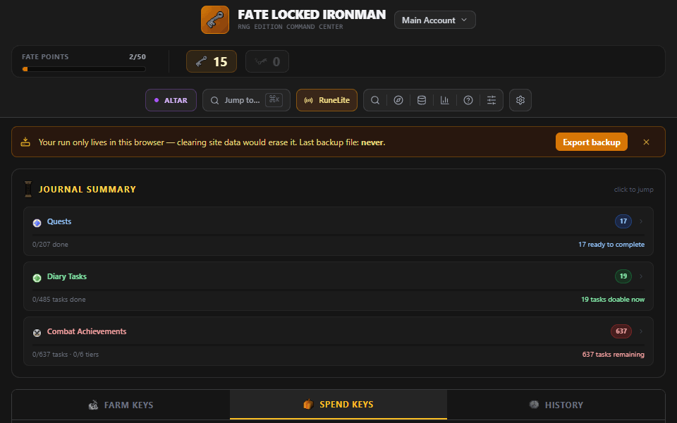
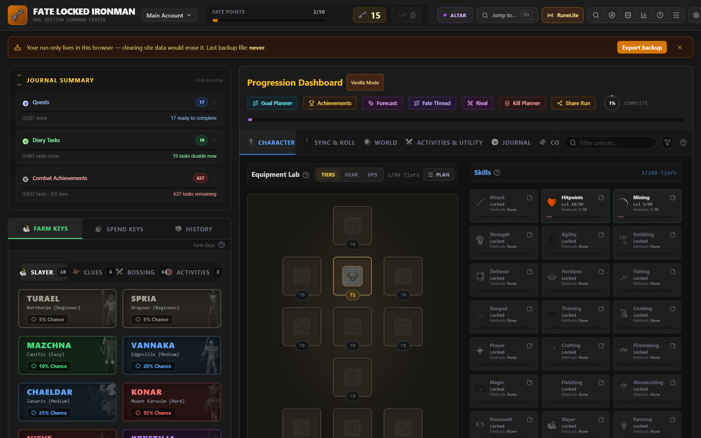
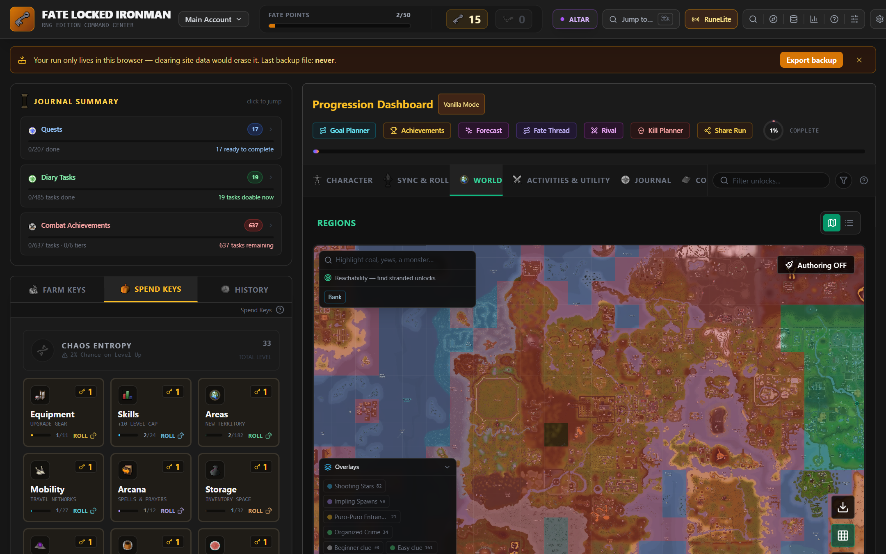
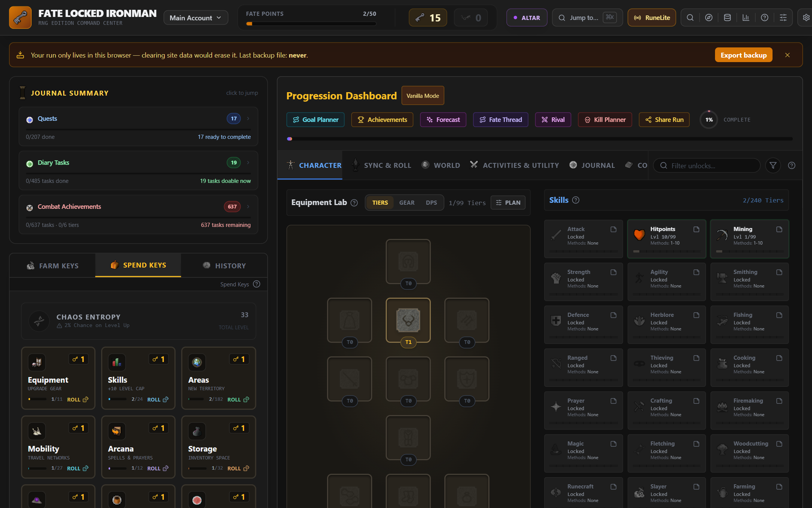
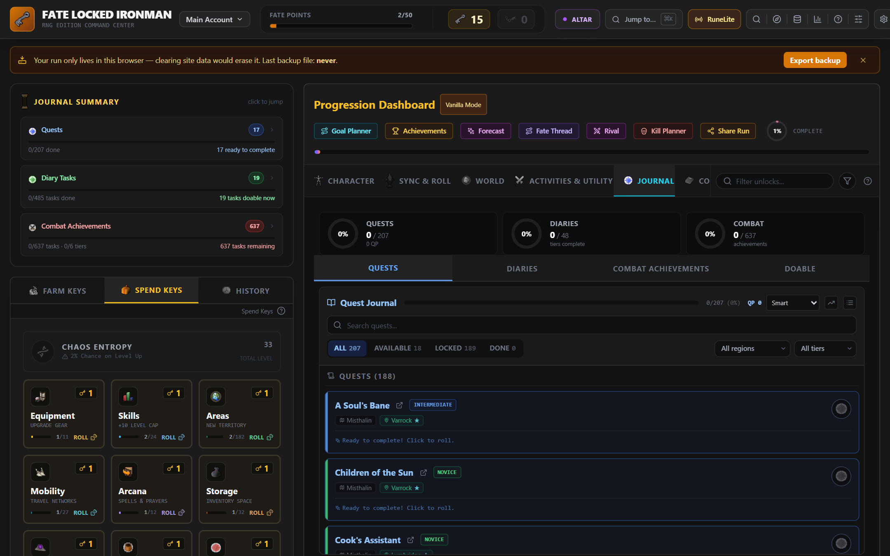

# Fate Locked Ironman

A companion tracker for the **Fate Locked Ironman** challenge mode in Old School RuneScape — a "snowball" restriction run where your account starts with *everything* locked, and Fate decides what you unlock.

**Live app:** https://nubles.github.io/OSRS-Fate-Locked/



## The concept

You begin as a fresh Ironman with nothing: no skills past level 1, no equipment slots, no map regions, no transport. To progress you:

1. **Farm Keys** — complete in-game tasks (Slayer tasks, Clue scrolls, quests, diaries, levels) and roll against their drop rate.
2. **Spend Keys** — cash Keys in on a content table (Skills, Equipment, Regions, Bosses, Minigames…) to unlock a random entry.
3. **Snowball** — each unlock opens up new tasks, which earn more Keys.

Bad luck is cushioned by **Fate Points** (a pity timer) and the **Void Altar**, where Fate Points can be spent on rituals. Rare **Omni-Keys** let you pick an unlock directly; **Chaos Keys** unlock from any table at random.

## Screenshots

| | |
|---|---|
|  |  |
| *Farm Keys & the Character dashboard* | *Spend Keys & the world region map* |
|  |  |
| *Unlock tables & the Equipment Lab* | *The Journal: quests, diaries & combat achievements* |

## Features

- **In-app Codex** — a full rulebook covering the Key Economy (every way to earn and spend keys, with a worked example), drop rates, game modes, the Void Altar, region bonuses, and equipment tiers. It renders from one typed source (`config/economy.ts`) that a consistency test pins to the engine's drop rates, so the rules you read always match the rules the game runs.
- **Farm Keys** — Slayer master & Clue scroll roll cards with animated rolls, plus pointers to skill/journal/collection-log rolling.
- **Spend Keys** — gacha-style unlock tables with reveal animations.
- **Progression Dashboard** — Character (equipment tiers, skills), World (interactive region map), Activities & Utility (bosses, minigames, guilds… with region tags), Journal (quests, diaries, combat achievements), and Collection Log.
- **Game Modes** — Vanilla, Casual, Hardcore, Region Rush, and a fully tunable Custom mode. The mode is chosen at the start of a run and locked in permanently.
- **Region modifiers** — in Region Rush, every continent you unlock grants a passive bonus.
- **Region map authoring** — paint custom region/chunk layouts, export/import as JSON.
- **Integrity & verification** — a tamper-evident hash chain over the run history, a deterministic run ID, invariant replay, and exportable verified bundles, so a completed run can be shared and checked.
- **Shareable run card & timelapse** — generate an image of your run, or play its history back as a narrated timelapse.
- **Profiles** — multiple independent runs in one browser.
- **RuneLite companion plugin** — imports the active profile, marks locked content in-game, explains the current chunk, and keeps supported gameplay detections in a local history.

## Tech stack

React 18 · TypeScript · Vite · Tailwind CSS · Recharts · Vitest

## Run locally

**Prerequisites:** Node.js 20+

```bash
npm install
npm run dev
```

The app runs at `http://localhost:5173`. All state is stored in the browser's `localStorage` — no backend, no API keys.

Fate Analytics can export a voluntary local aggregate for the
[key-economy evidence protocol](./docs/key-economy-evidence.md). Nothing is
uploaded automatically.

## Other scripts

```bash
npm run build     # production build to dist/
npm run preview   # preview the production build
npm test          # run the test suite (Vitest)
npm run test:watch
```

## Deployment

The app deploys to **GitHub Pages** automatically via `.github/workflows/deploy.yml` on every push to `main` — it installs dependencies, runs the tests, builds, and publishes. The build's base path is derived from the repository name, so it works regardless of what the repo is called.

To enable it on a fresh fork: **Settings → Pages → Build and deployment → Source → "GitHub Actions"**.

## Maintainer docs

- [`docs/RESOURCE_ENGINE.md`](./docs/RESOURCE_ENGINE.md) — the Resource Engine: data shape, the supply-chain analyzer, the three wiki-sourced generator scripts (`scripts/buildCraftables.mjs`, `scripts/buildPotions.mjs`, `scripts/buildSourceEnrichment.ts`), the enrichment merge pattern, the integrity-test contract, and the workflow for adding curated items.

## RuneLite plugin connection

The companion [RuneLite plugin](https://github.com/Nubles/OSRS-Fate-Locked-Runelite)
renders the active profile's tracker rules in-game and warns before locked
actions. The standalone repository exclusively owns plugin source, builds,
releases, and Plugin Hub review.

The player-facing [RuneLite Plugin Guide](https://nubles.github.io/OSRS-Fate-Locked/?open=runelite-guide)
uses the current Plugin Hub interface to explain installation, connection,
every panel section and setting, privacy, overlays, and troubleshooting.

Pairing is one-way. The browser publishes an app-authored v4 profile with
`POST /r/<code>`, then opens RuneLite with that code. The plugin retrieves and
validates the profile with `GET /r/<code>`. It does not upload gameplay,
account, event, acknowledgement, suggestion, or heartbeat data.

The browser cannot know whether RuneLite imported the profile because the
current Plugin Hub candidate sends no receipt. “Profile sent to RuneLite”
therefore describes a successful browser publish, not a live connection.
See [the relay protocol](./docs/online-relay.md) for the current boundary and
legacy compatibility routes.

## Disclaimer

Old School RuneScape and its assets are © Jagex Ltd. This is an unofficial fan-made tool and is not affiliated with Jagex.
